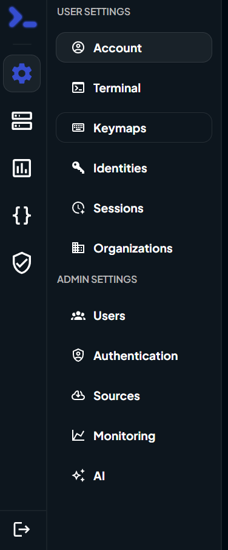
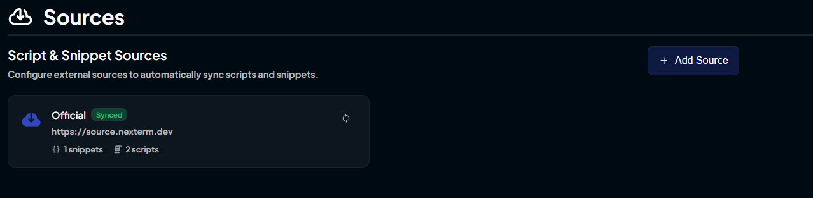
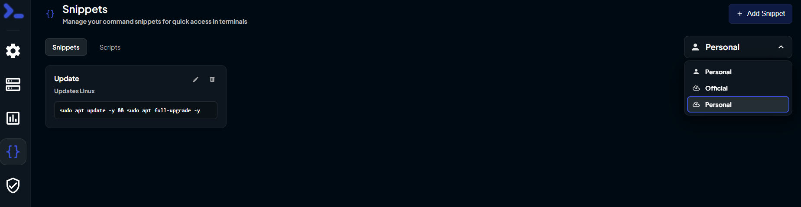

# 🎯 Adding Custom Sources to Nexterm

> Bring your own scripts and snippets! Follow this quick guide to add custom sources and supercharge your Nexterm experience.

---

## 📖 Step-by-Step Guide

### 1️⃣ Open Settings
Launch Nexterm and navigate to the **Settings** menu.

### 2️⃣ Go to Sources
In Settings, locate and click on the **Sources** section.

### 3️⃣ Add a New Source
Click the **Add** button to create a new custom source.

### 4️⃣ Enter Source Details
A form will appear asking for the following information:

| Field | Description |
|-------|-------------|
| **Name** | A descriptive name for your source (e.g., "My Scripts", "Team Snippets", "DevOps Tools") |
| **URL** | The repository URL where your scripts and snippets are stored |

**Example:**
- **Name:** `DevOps Toolkit`
- **URL:** `https://github.com/myteam/devops-scripts`

### 5️⃣ Create the Source
Click the **Create** button to save and register your custom source.

✅ Your source is now added to Nexterm!

---

## 🔍 Accessing Your Scripts & Snippets

### 📋 Finding Snippets

1. Click the **Snippets** icon in the main Nexterm interface
2. Look for the **dropdown box** under "Add Snippet"
3. **Select your repository name** from the dropdown
4. Your snippets are now displayed and ready to use!

### ⚙️ Finding Scripts

1. Switch to the **Scripts tab** (located next to the Snippets tab)
2. Your scripts from the custom source will **appear automatically**
3. Browse and execute scripts as needed

---

## 💡 Pro Tips

| Tip | Benefit |
|-----|---------|
| 📌 **Multiple Sources** | Add as many custom sources as needed—just repeat the process! |
| 🔄 **Auto Sync** | Your repository syncs automatically; push updates and they appear in Nexterm |
| 📖 **Follow Format** | Ensure your repo follows the [Custom Sources format](custom-sources.md) with correct file extensions |
| 🏷️ **Clear Names** | Use descriptive names for sources so they're easy to identify and find |
| 🌐 **Public & Private** | Add repositories from GitHub, GitLab, or any Git hosting platform |

---

## 🚀 Next Steps

- Learn how to [organize your custom sources properly](custom-sources.md)
- Check out [real-world examples](https://github.com/gnmyt/NexStore/tree/main/nexterm) from the community
- Start building your personal script and snippet library!
