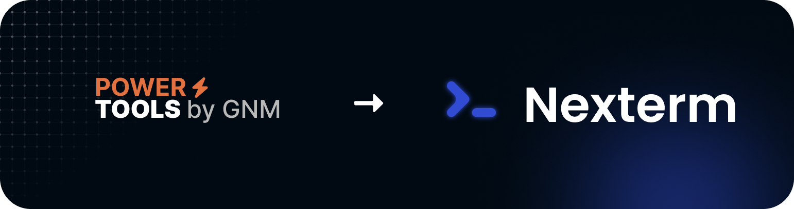

<h1 style="text-align: center;">PowerTools migrated to Nexterm</h1>

## Introduction

You probably got redirected here from the [PowerTools](https://tools.gnmyt.dev) website. In this article, I want to
explain why I decided to make this change and what it means for you.

## What was PowerTools?

If you ended up here and don't know what PowerTools is, you might have looked through the GitHub repository and found
this page. PowerTools was a collection of tools I created to help developers in their daily work.

It had tools like Base64 Encoder/Decoder, QR-Code generators, and some other tools that I found useful. The main part
however was the App Store, where you could deploy software to your server with a single click.

## Why the change?

For starters, hosting the server for the SSH connections was a pain. Not only were the servers down most of the time,
but there was also the issue of security. Every time a connection to a server has been made, every connection can be
traced back to the PowerTools server. If anyone tried to abuse this by hacking others or ddos someone, it would be
traced back to my server, and I would be responsible for it. This was a huge security risk, and I didn't want to take
it.

Another reason was the fact that PowerTools used bash install scripts to deploy software. Not only was this a pain to
make those scripts available for most linux distributions, but it was also a pain to maintain them. Because of that,
updating the software was not even possible most of the time.

## What now?

I decided to make a change. I liked the idea of the app store in PowerTools, but I wanted to make it better. This is why
I implemented the app store in Nexterm. Since you already imported your servers into Nexterm, you can now deploy
software
to your servers with a single click. The difference is that the software is now deployed using Docker, which is more
secure and easier to maintain.

## What's with the other tools?

Since Nexterm is a server management software, it doesn't really make sense to have tools like Base64 Encoder/Decoder
in it. However, I would recommend you to check out the [IT Tools](https://it-tools.tech/) project, which is an
open-source collection of even more tools than PowerTools had.